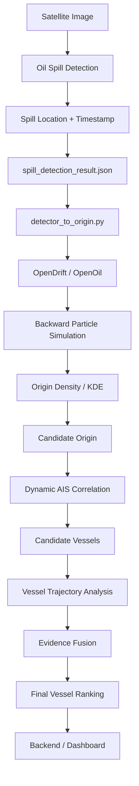

# SpillTrace --- Oil Spill Origin & Vessel Correlation

This repository contains the **OpenDrift-based oil spill tracking and
AIS vessel correlation pipeline** developed for the SIH 2026 oil spill
detection problem.

The purpose of this part of the project is to:

1.  Detect an oil spill from satellite imagery.
2.  Use ocean currents and wind data to estimate where the spill could
    have originated.
3.  Use AIS vessel data to find vessels that were near the estimated
    origin.
4.  Analyze vessel movement around the origin.
5.  Combine the evidence and rank potential source vessels.

> **Important:** The system identifies **potential source vessels for
> investigation**. It does not legally prove which vessel caused the
> spill.

------------------------------------------------------------------------

## 1. Overall System

The complete project combines the team's satellite-image detection
system with this OpenDrift + AIS pipeline.

``` text
                    SATELLITE IMAGE
                          |
                          v
                 +------------------+
                 | Oil Spill Model  |
                 | (Team Backend)   |
                 +------------------+
                          |
                          | Spill detected
                          | latitude
                          | longitude
                          | timestamp
                          v
              +------------------------+
              | OpenDrift / OpenOil    |
              | Backward Simulation    |
              +------------------------+
                          |
                          | Estimated origin
                          v
              +------------------------+
              | AIS Spatial + Time    |
              | Correlation           |
              +------------------------+
                          |
                          v
              +------------------------+
              | Vessel Trajectory     |
              | Analysis              |
              +------------------------+
                          |
                          v
              +------------------------+
              | Evidence Fusion       |
              | & Vessel Ranking      |
              +------------------------+
                          |
                          v
                Potential Source
                     Vessels
                          |
                          v
                    DASHBOARD
```

The work in this repository covers the pipeline from **OpenDrift
simulation through vessel ranking**.

------------------------------------------------------------------------

## 2. Project Structure

``` text
Opendrift/
│
├── AIS/
│   ├── phase5_output/
│   │
│   ├── ais_sample.csv
│   ├── ais_trajectory_matching.py
│   ├── dynamic_ais_correlation.py
│   ├── phase3_ais_correlation.py
│   ├── phase5_2_generate_synthetic_ais.py
│   ├── phase5_2_vessel_trajectory_analysis.py
│   └── phase5_3_evidence_fusion.py
│
├── bay_of_bengal/
│   ├── phase4_4_output/
│   │
│   ├── detector_to_origin.py
│   └── spill_detection_result.json
│
├── test_data/
│
├── bay_of_bengal_currents.nc
├── bay_of_bengal_wind.nc
│
├── opendrift_backward_test.py
├── opendrift_origin_density.py
├── opendrift_test.py
│
├── requirements.txt
└── .gitignore
```

`opendrift_env/` is the local Python virtual environment and should
**not** be uploaded to GitHub.

------------------------------------------------------------------------

# 3. The Core Idea in Simple Words

The easiest way to understand this repository is:

> **Satellite imagery tells us where the oil is.**

> **OpenDrift estimates where the oil could have come from.**

> **AIS tells us which vessels were nearby.**

> **Trajectory analysis examines how those vessels were moving.**

> **Evidence fusion combines these clues and produces a ranked list of
> potential source vessels.**

``` text
WHERE IS THE OIL?
        |
        v
Satellite Detection
        |
        v
WHERE DID IT COME FROM?
        |
        v
OpenDrift Backtracking
        |
        v
WHO WAS THERE?
        |
        v
AIS Correlation
        |
        v
WHO MATCHES THE MOVEMENT?
        |
        v
Trajectory Analysis
        |
        v
WHICH VESSELS SHOULD BE INVESTIGATED?
        |
        v
Evidence Fusion
```

------------------------------------------------------------------------

# 4. Phase 1 --- OpenDrift Forward Simulation

### Main file

``` text
opendrift_test.py
```

### Purpose

Phase 1 was used to understand and validate the OpenDrift/OpenOil
simulation.

A hypothetical oil spill is released at a known location and OpenDrift
simulates how the oil moves forward with environmental conditions.

``` text
Initial Spill Location
        |
        v
+-------------------+
| OpenOil / OpenDrift|
+-------------------+
        |
        | Ocean currents
        | Wind
        v
Oil Particle Movement
        |
        v
Final Particle Positions
```

The simulation uses multiple oil particles around the spill location.

The particles are affected by environmental data such as:

-   Ocean currents
-   Wind
-   Other environmental parameters supported by OpenOil

### Why this phase was necessary

Before trying to calculate an unknown spill origin, we first needed to
confirm that:

-   OpenDrift works correctly.
-   OpenOil can simulate oil movement.
-   Environmental data can be loaded.
-   Particle trajectories can be generated.

This phase is mainly a **model validation / learning phase**.

------------------------------------------------------------------------

# 5. Phase 2 --- Backward Simulation & Origin Estimation

Phase 2 is where OpenDrift becomes useful for finding the possible
origin of an oil spill.

Instead of asking:

> "Where will this oil go?"

we ask:

> "If the oil is here now, where could it have come from?"

OpenDrift supports backward trajectory simulation using a negative time
step.

``` text
                   PRESENT
                     |
                     | Spill detected here
                     v
              +-------------+
              | Spill Point |
              +-------------+
                     |
                     | Move BACKWARD
                     |
                     v
              Particle Cloud
                     |
                     v
             Possible Origin Region
```

## Files

``` text
opendrift_backward_test.py
opendrift_origin_density.py
```

------------------------------------------------------------------------

## 5.1 `opendrift_backward_test.py`

This file tests the backward simulation.

Instead of using a positive time step:

``` text
+900 seconds
```

the backward simulation uses:

``` text
-900 seconds
```

This tells OpenDrift to simulate the particles backward in time.

``` text
Current Spill Position
        |
        | -15 min
        v
Earlier Position
        |
        | -15 min
        v
Earlier Position
        |
        | ...
        v
Possible Origin Region
```

------------------------------------------------------------------------

## 5.2 `opendrift_origin_density.py`

A backward simulation produces many possible particle positions.

We then need to determine:

> Where are the particles concentrated?

This file performs density analysis on the backward particle positions.

``` text
Backward Particle Positions

        .  .       .
    . . . . .   .
      . . . . .
   . . . . . . .
        . . .
          .

             |
             v

       Density Analysis

             |
             v

     Highest Density Area

             |
             v

      Candidate Origin
```

The current implementation uses KDE (Kernel Density Estimation) to
estimate where the backward particles are most concentrated.

The output includes:

-   Candidate origin
-   50% density region
-   80% density region
-   Density visualization

### Important

The estimated origin is a **candidate origin**, not a guaranteed exact
source location.

Environmental model uncertainty, wind/current errors, spill spreading,
and satellite detection uncertainty can all affect the result.

------------------------------------------------------------------------

# 6. Phase 3 --- AIS Correlation

Once we have a possible spill origin, the next question is:

> **Which vessels were near this location around the relevant time?**

AIS means:

**Automatic Identification System**

AIS can provide information such as:

-   Vessel MMSI
-   Vessel name
-   Timestamp
-   Latitude
-   Longitude
-   Speed over ground (SOG)
-   Course over ground (COG)
-   Ship type

## Files

``` text
AIS/
├── ais_sample.csv
├── ais_trajectory_matching.py
└── phase3_ais_correlation.py
```

------------------------------------------------------------------------

## 6.1 `ais_sample.csv`

This is the sample AIS dataset used during development and testing.

Typical fields include:

``` text
mmsi
vessel_name
timestamp
latitude
longitude
sog
cog
ship_type
```

The current sample is **development/test data**.

For real deployment, this should be replaced by actual historical AIS
data covering the required:

-   Geographic region
-   Time period

------------------------------------------------------------------------

# 7. Phase 3.1 --- Spatial & Temporal AIS Filtering

### File

``` text
AIS/phase3_ais_correlation.py
```

The first AIS stage removes vessels that could not realistically be
related to the spill.

The filtering considers:

### Spatial relationship

Was the vessel close enough to the estimated origin?

### Temporal relationship

Was the vessel there at approximately the right time?

Pipeline:

``` text
AIS Data
   |
   v
+----------------------+
| Time Filtering       |
| Was vessel there     |
| at relevant time?    |
+----------------------+
   |
   v
+----------------------+
| Spatial Filtering    |
| Was vessel close to  |
| estimated origin?    |
+----------------------+
   |
   v
Candidate Vessels
```

This prevents us from analyzing every vessel in the entire ocean.

------------------------------------------------------------------------

# 8. Phase 3.2 --- Vessel Trajectory Analysis

### File

``` text
AIS/ais_trajectory_matching.py
```

Being near the origin is not enough.

For example:

``` text
Vessel A
-------> --------->

             X Spill Origin
```

The vessel may simply have passed nearby.

Therefore, we analyze the vessel's movement.

The system considers factors such as:

-   Distance from origin
-   Whether the vessel approached the region
-   Whether it departed afterward
-   Speed
-   Course
-   Speed changes
-   Course changes
-   AIS continuity

Pipeline:

``` text
Candidate Vessel
       |
       v
AIS Track
       |
       +---- Distance
       |
       +---- Approach
       |
       +---- Departure
       |
       +---- Speed
       |
       +---- Course
       |
       +---- Continuity
       |
       v
Trajectory Analysis
```

------------------------------------------------------------------------

# 9. Phase 4 --- Real Bay of Bengal Environmental Data

Phase 4 moves from controlled OpenDrift testing to a more realistic
geographic scenario.

The region used is the:

**Bay of Bengal**

Environmental datasets:

``` text
bay_of_bengal_currents.nc
bay_of_bengal_wind.nc
```

These contain environmental information used by OpenDrift.

------------------------------------------------------------------------

# 10. Phase 4.1 --- Forward Simulation

The system was tested using Bay of Bengal environmental data.

``` text
Bay of Bengal
     |
     +-------------------+
     |                   |
     v                   v
Ocean Currents         Wind
     |                   |
     +---------+---------+
               |
               v
         OpenDrift/OpenOil
               |
               v
        Oil Particle Track
```

The purpose was to confirm that OpenDrift can operate using
environmental fields for the target region.

------------------------------------------------------------------------

# 11. Phase 4.2 --- Backward Origin Estimation

A hypothetical spill location is provided.

OpenDrift then runs backward:

``` text
Detected Spill
     |
     v
Backward Simulation
     |
     v
Particle Cloud
     |
     v
Density Estimation
     |
     v
Candidate Origin
```

The result contains a candidate origin and uncertainty region.

------------------------------------------------------------------------

# 12. Phase 4.3 --- Forward/Backward Validation

This phase checks whether the backward method can approximately recover
a known starting point.

``` text
Known Origin
     |
     | Forward simulation
     v
Known Spill Position
     |
     | Backward simulation
     v
Recovered Origin
```

The recovered origin is compared with the original known origin.

This is a **controlled model validation**, not proof of real-world
source-location accuracy.

------------------------------------------------------------------------

# 13. Phase 4.4 --- Connecting Spill Detection to OpenDrift

This is one of the most important parts of the project.

### Files

``` text
bay_of_bengal/
├── phase4_4_output/
├── detector_to_origin.py
└── spill_detection_result.json
```

The satellite oil-spill detector produces information such as:

``` json
{
    "spill_detected": true,
    "latitude": 15.0,
    "longitude": 88.0,
    "timestamp": "2026-09-01T23:00:00"
}
```

This becomes the input to OpenDrift.

------------------------------------------------------------------------

# 14. Detector → OpenDrift Pipeline

``` text
Satellite Image
       |
       v
Oil Spill Detection Model
       |
       | spill_detected
       | latitude
       | longitude
       | timestamp
       v
spill_detection_result.json
       |
       v
detector_to_origin.py
       |
       v
OpenDrift / OpenOil
       |
       | Backward simulation
       v
Backward Particle Cloud
       |
       v
Density Estimation
       |
       v
origin_result.json
       |
       v
Candidate Origin
```

The important idea is:

> The satellite detector does not need to know how OpenDrift works. It
> only needs to provide the spill status, coordinates, and timestamp.

------------------------------------------------------------------------

# 15. Phase 5 --- Dynamic AIS Correlation

After estimating the spill origin, we need to find vessels that were
actually present around that origin during the relevant time period.

This is the bridge between:

``` text
OpenDrift
    |
    v
Estimated Origin
    |
    v
AIS
```

------------------------------------------------------------------------

# 16. Phase 5.1 --- Dynamic AIS Filtering

### File

``` text
AIS/dynamic_ais_correlation.py
```

This phase uses the dynamically calculated origin from Phase 4.

It does **not** use a manually fixed origin.

Pipeline:

``` text
origin_result.json
        |
        v
Candidate Origin
        |
        +----------------+
        |                |
        v                v
   Origin Region     Origin Time
        |                |
        +--------+-------+
                 |
                 v
              AIS Data
                 |
                 v
       Spatial + Time Filter
                 |
                 v
         Candidate Vessels
```

The system calculates the relevant time window around the spill/origin
and checks whether AIS observations overlap that window.

------------------------------------------------------------------------

# 17. Phase 5.2 --- Vessel Trajectory Analysis

### Files

``` text
AIS/phase5_2_generate_synthetic_ais.py
AIS/phase5_2_vessel_trajectory_analysis.py
```

## `phase5_2_generate_synthetic_ais.py`

This file generates synthetic AIS data for testing the complete
pipeline.

The synthetic vessels include:

``` text
Synthetic Alpha
Synthetic Bravo
Synthetic Charlie
Synthetic Delta
Synthetic Echo
```

This is **test data**, not real vessel information.

It allows the pipeline to be tested when real AIS data is unavailable.

------------------------------------------------------------------------

## `phase5_2_vessel_trajectory_analysis.py`

This analyzes the movement of the candidate vessels.

The system considers:

-   Distance from origin
-   Approach toward origin
-   Departure from origin
-   Average speed
-   Speed variation
-   Course variation
-   AIS continuity

Pipeline:

``` text
Candidate Vessel
       |
       v
AIS Track
       |
       +---- Distance to origin
       |
       +---- Approach?
       |
       +---- Departure?
       |
       +---- Speed stability
       |
       +---- Course stability
       |
       +---- AIS continuity
       |
       v
Trajectory Score
```

------------------------------------------------------------------------

# 18. Phase 5.3 --- Evidence Fusion

### File

``` text
AIS/phase5_3_evidence_fusion.py
```

This is the final stage of the current repository.

Instead of relying on only one measurement, the system combines:

### Phase 5.1

Spatial + temporal compatibility

and

### Phase 5.2

Vessel trajectory behavior

``` text
              Candidate Vessel
                     |
          +----------+----------+
          |                     |
          v                     v
   Phase 5.1 Score       Phase 5.2 Score
   Spatial + Time        Trajectory
          |                     |
          +----------+----------+
                     |
                     v
              Evidence Fusion
                     |
                     v
             Final Vessel Score
                     |
                     v
             Ranked Candidates
```

The current prototype uses:

``` text
Final Score =
    55% × Phase 5.1 Score
  + 45% × Phase 5.2 Score
```

These weights are **prototype weights**, not calibrated probabilities.

The result is used to rank vessels for further investigation.

------------------------------------------------------------------------

# 19. Final Phase 5.3 Outputs

The main Phase 5.3 output is:

``` text
AIS/phase5_output/phase5_3_final_vessel_ranking.csv
```

The JSON result is:

``` text
AIS/phase5_output/phase5_3_result.json
```

The evidence map is:

``` text
AIS/phase5_output/phase5_3_evidence_map.png
```

The JSON result is particularly useful for backend integration.

------------------------------------------------------------------------

# 20. Complete Pipeline



In simple form:

``` text
Satellite Detection
        ↓
Spill Location + Time
        ↓
OpenDrift Backtracking
        ↓
Candidate Origin
        ↓
AIS Spatial + Time Filtering
        ↓
Candidate Vessels
        ↓
Trajectory Analysis
        ↓
Evidence Fusion
        ↓
Potential Source Vessel Ranking
        ↓
Dashboard
```

------------------------------------------------------------------------

# 21. How to Connect This Pipeline to the Backend

The easiest way to understand the integration is:

``` text
FRONTEND
   |
   | Upload satellite image
   v
BACKEND
   |
   +----> Oil Spill Detection
   |
   +----> OpenDrift
   |
   +----> AIS Analysis
   |
   +----> Final Ranking
   |
   v
FRONTEND DASHBOARD
```

The frontend should **not directly run OpenDrift or AIS scripts**.

The backend should control the pipeline.

------------------------------------------------------------------------

# 22. Backend Input

The backend first receives the result from the satellite detection
model.

Example:

``` json
{
    "spill_detected": true,
    "latitude": 15.0,
    "longitude": 88.0,
    "timestamp": "2026-09-01T23:00:00"
}
```

This information can be passed to the OpenDrift pipeline.

------------------------------------------------------------------------

# 23. Backend → OpenDrift

The backend can save the detector result as:

``` text
bay_of_bengal/spill_detection_result.json
```

Then run:

``` text
bay_of_bengal/detector_to_origin.py
```

Conceptually:

``` text
Detector Result
      |
      v
Validate coordinates/time
      |
      v
Load environmental data
      |
      v
Run backward OpenDrift
      |
      v
Calculate origin density
      |
      v
Save origin_result.json
```

The backend then reads the generated origin result from:

``` text
bay_of_bengal/phase4_4_output/
```

The exact generated filename should be checked from the current script
before wiring it into the production API.

------------------------------------------------------------------------

# 24. Backend → AIS

The origin result is then passed to the AIS pipeline.

Conceptually:

``` text
origin_result.json
       |
       v
AIS correlation
       |
       v
Candidate vessels
       |
       v
Trajectory analysis
       |
       v
Evidence fusion
       |
       v
phase5_3_result.json
```

The backend can then return the final results to the frontend.

------------------------------------------------------------------------

# 25. Recommended Backend Response

A backend response can be structured approximately like this:

``` json
{
    "spill_detected": true,

    "spill_location": {
        "latitude": 15.0,
        "longitude": 88.0
    },

    "spill_time": "2026-09-01T23:00:00",

    "estimated_origin": {
        "latitude": 14.966169,
        "longitude": 87.989380
    },

    "origin_uncertainty": {
        "region_50_percent": "...",
        "region_80_percent": "..."
    },

    "potential_source_vessels": [
        {
            "mmsi": "700000005",
            "vessel_name": "Synthetic Echo",
            "score": 89.05,
            "evidence_level": "Strong screening match"
        },
        {
            "mmsi": "700000003",
            "vessel_name": "Synthetic Charlie",
            "score": 65.79,
            "evidence_level": "Moderate screening match"
        }
    ]
}
```

The exact API structure can be changed to match the team's existing
backend.

------------------------------------------------------------------------

# 26. Two Ways to Integrate the Backend

## Option A --- File-Based Integration

This is the easiest option for the current prototype.

``` text
Backend
   |
   v
Create spill_detection_result.json
   |
   v
Run OpenDrift script
   |
   v
Read origin result
   |
   v
Run AIS pipeline
   |
   v
Read phase5_3_result.json
   |
   v
Return JSON to frontend
```

This approach matches the current repository structure and is useful for
the SIH prototype.

------------------------------------------------------------------------

## Option B --- Direct Python Integration

For a cleaner production system, the logic inside the scripts can
eventually be converted into reusable Python functions.

Instead of:

``` text
Backend
   |
   v
Run Python file
   |
   v
Read JSON
```

the backend can call reusable functions:

``` text
Backend
   |
   v
Python Function
   |
   +---- OpenDrift
   |
   +---- AIS
   |
   +---- Evidence Fusion
   |
   v
Python Dictionary / JSON
```

Conceptually:

``` python
origin = estimate_origin(
    latitude=15.0,
    longitude=88.0,
    timestamp="2026-09-01T23:00:00"
)

vessels = correlate_ais(origin)

result = rank_vessels(vessels)
```

The exact function names above are illustrative; the current repository
scripts should be refactored before using this pattern directly.

------------------------------------------------------------------------

# 27. Important Data Flow

The most important data passed between components is:

``` text
Satellite Detector
       |
       | latitude
       | longitude
       | timestamp
       v
OpenDrift
       |
       | candidate origin
       | uncertainty region
       v
AIS Correlation
       |
       | candidate vessels
       v
Trajectory Analysis
       |
       | trajectory evidence
       v
Evidence Fusion
       |
       | final ranking
       v
Backend
       |
       v
Dashboard
```

------------------------------------------------------------------------

# 28. Current Data Sources

## Environmental Data

``` text
bay_of_bengal_currents.nc
bay_of_bengal_wind.nc
```

These are used by the Bay of Bengal OpenDrift simulations.

## OpenDrift Test Data

``` text
test_data/
```

This contains environmental test data used during the initial OpenDrift
validation.

## AIS

``` text
AIS/ais_sample.csv
```

This is development/test AIS data.

For Phase 5 testing:

``` text
AIS/phase5_2_generate_synthetic_ais.py
```

generates synthetic AIS observations.

> **Synthetic AIS is used only to validate the pipeline. Real deployment
> requires real historical AIS data with timestamps matching the spill
> event.**

------------------------------------------------------------------------

# 29. Important Files Summary

  ----------------------------------------------------------------------------------
  File                                           Purpose
  ---------------------------------------------- -----------------------------------
  `opendrift_test.py`                            Phase 1 forward OpenDrift/OpenOil
                                                 test

  `opendrift_backward_test.py`                   Phase 2 backward trajectory test

  `opendrift_origin_density.py`                  Origin density/KDE analysis

  `bay_of_bengal_currents.nc`                    Bay of Bengal current data

  `bay_of_bengal_wind.nc`                        Bay of Bengal wind data

  `bay_of_bengal/detector_to_origin.py`          Connects spill detector output to
                                                 OpenDrift

  `bay_of_bengal/spill_detection_result.json`    Input from spill detection model

  `AIS/ais_sample.csv`                           Sample AIS data

  `AIS/phase3_ais_correlation.py`                Phase 3 AIS filtering/correlation

  `AIS/ais_trajectory_matching.py`               Phase 3 vessel trajectory analysis

  `AIS/dynamic_ais_correlation.py`               Phase 5.1 dynamic AIS correlation

  `AIS/phase5_2_generate_synthetic_ais.py`       Generates synthetic AIS for testing

  `AIS/phase5_2_vessel_trajectory_analysis.py`   Phase 5.2 trajectory analysis

  `AIS/phase5_3_evidence_fusion.py`              Phase 5.3 final evidence fusion

  `AIS/phase5_output/`                           Phase 5 results and visualizations

  `bay_of_bengal/phase4_4_output/`               Phase 4.4 OpenDrift outputs

  `requirements.txt`                             Python dependencies

  `test_data/`                                   OpenDrift testing data
  ----------------------------------------------------------------------------------

------------------------------------------------------------------------

# 30. Running the Project

Create a Python virtual environment:

``` bash
python -m venv opendrift_env
```

Activate it on Windows:

``` bash
opendrift_env\Scripts\activate
```

Install dependencies:

``` bash
pip install -r requirements.txt
```

The scripts can then be run according to the phase being tested.

For example:

``` bash
python opendrift_test.py
```

``` bash
python opendrift_backward_test.py
```

For AIS stages:

``` bash
python AIS/phase3_ais_correlation.py
```

``` bash
python AIS/dynamic_ais_correlation.py
```

``` bash
python AIS/phase5_2_vessel_trajectory_analysis.py
```

``` bash
python AIS/phase5_3_evidence_fusion.py
```

> Some scripts depend on output files generated by earlier phases, so
> the pipeline should normally be executed in sequence.

------------------------------------------------------------------------

# 31. Phase Dependency

``` text
Phase 1
OpenDrift Forward Test
       |
       v
Phase 2
Backward Simulation
       |
       v
Origin Estimation
       |
       v
Phase 3
AIS Correlation
       |
       v
Phase 4
Bay of Bengal + Detector Integration
       |
       v
Phase 5.1
Dynamic AIS Correlation
       |
       v
Phase 5.2
Vessel Trajectory Analysis
       |
       v
Phase 5.3
Evidence Fusion
       |
       v
Final Vessel Ranking
```

------------------------------------------------------------------------

# 32. What the System Ultimately Produces

For a detected oil spill, the system aims to produce:

``` text
1. Spill Location
        ↓
2. Estimated Spill Origin
        ↓
3. Origin Uncertainty Region
        ↓
4. Candidate Vessels
        ↓
5. Vessel Trajectory Evidence
        ↓
6. Ranked Potential Source Vessels
```

This information can then be displayed on the team's dashboard.

------------------------------------------------------------------------

# 33. Important Limitations

### 1. Origin is an estimate

OpenDrift reconstructs a possible origin based on environmental
conditions and the detected spill location.

It should not be treated as an exact source location.

### 2. AIS does not prove responsibility

A vessel being near the estimated origin does not prove that it caused
the spill.

The system should therefore use terms such as:

``` text
Potential Source Vessel
Candidate Vessel
Screening Match
```

rather than:

``` text
Responsible Vessel
```

### 3. Synthetic AIS

The Phase 5 testing currently uses synthetic AIS data.

Real AIS data must be used for real-world deployment.

### 4. Prototype scoring

The Phase 5.3 weights:

``` text
55% Spatial/Temporal
45% Trajectory
```

are prototype weights.

They are not calibrated probabilities of responsibility.

------------------------------------------------------------------------

# 34. Role of This Repository in the Full SIH Project

The complete SIH system has multiple components.

This repository mainly handles:

``` text
                Satellite Detection
                       |
                       v
              [Other Team Component]
                       |
                       v
              Spill Location/Time
                       |
                       v
       +-------------------------------+
       |       THIS REPOSITORY         |
       |                               |
       | OpenDrift                     |
       |      ↓                        |
       | Origin Estimation             |
       |      ↓                        |
       | AIS Correlation               |
       |      ↓                        |
       | Trajectory Analysis           |
       |      ↓                        |
       | Evidence Fusion               |
       |      ↓                        |
       | Potential Source Vessels      |
       +-------------------------------+
                       |
                       v
                    Dashboard
```

Phase 6 / final dashboard integration is handled separately by the rest
of the team.

------------------------------------------------------------------------

# 35. Final Team Handoff

The clean handoff between this module and the main backend is:

``` text
                    THIS MODULE
┌─────────────────────────────────────────────┐
│ Satellite detector output                   │
│              ↓                              │
│ spill_detection_result.json                 │
│              ↓                              │
│ OpenDrift backward simulation               │
│              ↓                              │
│ Candidate origin                            │
│              ↓                              │
│ AIS correlation                             │
│              ↓                              │
│ Trajectory analysis                         │
│              ↓                              │
│ Evidence fusion                             │
│              ↓                              │
│ phase5_3_result.json                        │
└─────────────────────┬───────────────────────┘
                      │
                      │ JSON
                      v
                MAIN BACKEND
                      |
                      v
                 DASHBOARD
```

The backend developer mainly needs to understand the **JSON input/output
contract**. They do not need to understand every internal OpenDrift
calculation to integrate the module.

------------------------------------------------------------------------

# 36. One-Line Summary

> **SpillTrace combines satellite oil-spill detection, OpenDrift
> backward trajectory modeling, AIS vessel correlation, vessel
> trajectory analysis, and evidence fusion to identify and rank
> potential source vessels for further investigation.**
